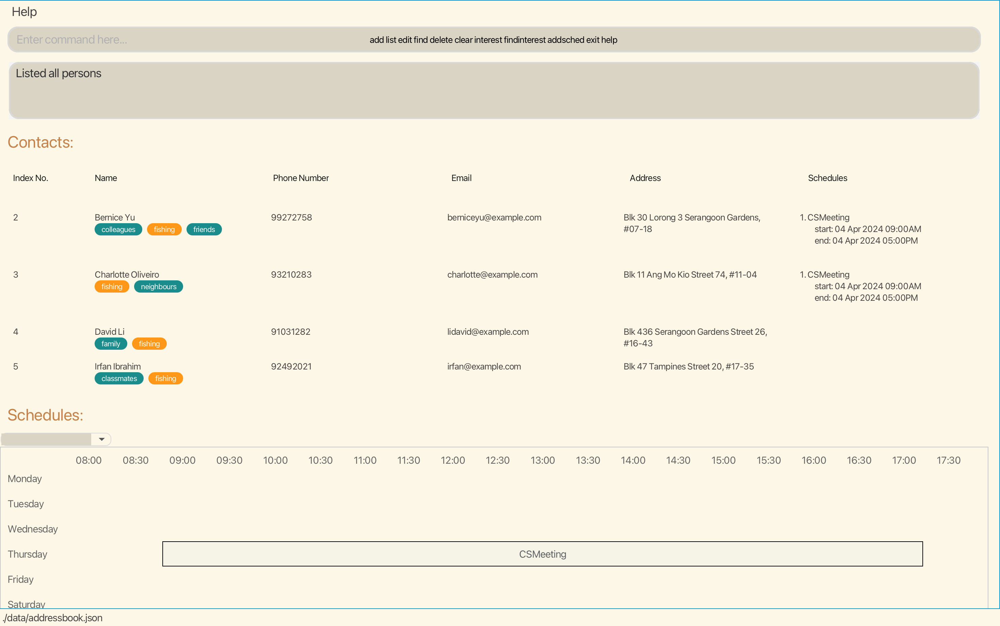
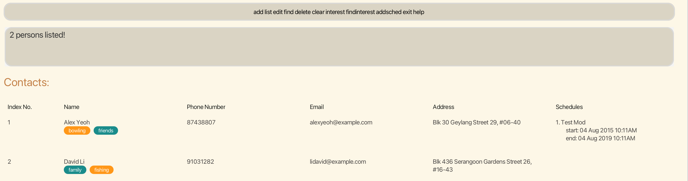
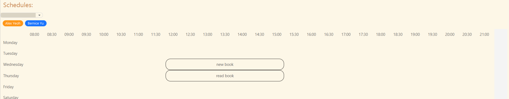
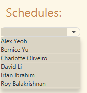
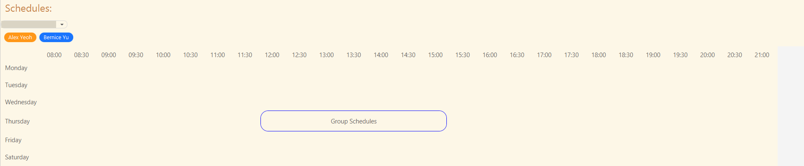
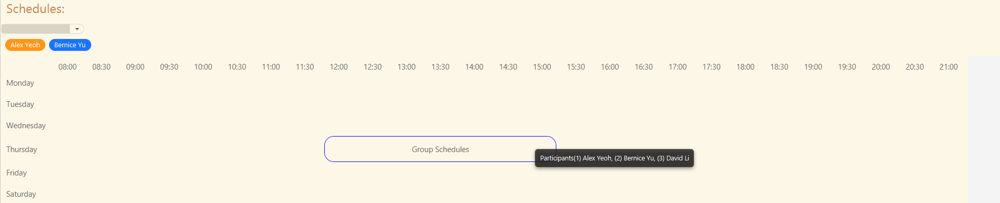
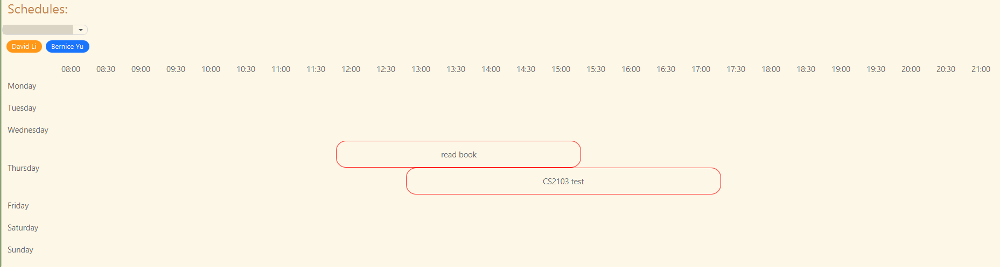

# Moddie User Guide

Moddie is a **desktop app for managing schedules, interests, and tags of contacts optimized for use via a Line Interface** (CLI) while still having the benefits of a Graphical User Interface (GUI). If you can type fast, Moddie can get your contact and schedule management tasks done faster than traditional GUI apps.

<!-- * Table of Contents -->
<page-nav-print />

--------------------------------------------------------------------------------------------------------------------

## Quick start

1. Ensure you have Java `11` or above installed in your Computer.

1. Download the latest `Moddie.jar` from [here](https://github.com/AY2324S2-CS2103-F15-4/tp/releases).

1. Copy the file to the folder you want to use as the _home folder_ for your Moddie.

1. Open a command terminal, `cd` into the folder you put the jar file in, and use the `java -jar Moddie.jar` command to run the application.<br>
   A GUI similar to the below should appear in a few seconds. Note how the app contains some sample data.<br>
   

1. Type the command in the command box and press Enter to execute it. e.g. typing **`help`** and pressing Enter will open the help window.<br>
   Some example commands you can try:

   * `list` : Lists all contacts.

   * `add n/John Doe p/98765432 e/johnd@example.com a/John street, block 123, #01-01` : Adds a contact named `John Doe` to the Address Book.

   * `delete 3` : Deletes the 3rd contact shown in the current list.

   * `clear` : Deletes all contacts.

   * `exit` : Exits the app.

1. Refer to the [Features](#features) below for details of each command.

<div style="page-break-after: always;"></div>

--------------------------------------------------------------------------------------------------------------------

## Features

<box type="info" seamless>

**Notes about the command format:**<br>

* Words in `UPPER_CASE` are the parameters to be supplied by the user.<br>
  e.g. in `add n/NAME`, `NAME` is a parameter which can be used as `add n/John Doe`.

* Items in square brackets are optional.<br>
  e.g `n/NAME [t/TAG]` can be used as `n/John Doe t/friend` or as `n/John Doe`.

* Items with `…`​ after them can be used multiple times including zero times.<br>
  e.g. `[t/TAG]…​` can be used as ` ` (i.e. 0 times), `t/friend`, `t/friend t/family` etc.

* Parameters can be in any order.<br>
  e.g. if the command specifies `n/NAME p/PHONE_NUMBER`, `p/PHONE_NUMBER n/NAME` is also acceptable.

* Extraneous parameters for commands that do not take in parameters (such as `help`, `list`, `exit` and `clear`) will be ignored.<br>
  e.g. if the command specifies `help 123`, it will be interpreted as `help`.

* If you are using a PDF version of this document, be careful when copying and pasting commands that span multiple lines as space characters surrounding line-breaks may be omitted when copied over to the application.
</box>

### Viewing help : `help`

Shows a message explaning how to access the help page.

Format: `help`

Expected success outcome:
```
Opened help window.
```


Expected failure outcome:
```
Help not available. Please try again.
```

### Suggestion bar:
Prompts suggestions to user based on their inputs.
Expected success outcome:
```
Lists down similar suggestion seperated by whitespaces matching user inputs
Upon typing some input and deleting it entirely, will prompt it to list down all commands!
```


<div style="page-break-after: always;"></div>

### Adding a person: `add`

Adds a person to the address book with their information.

Format: `add n/NAME p/PHONE_NUMBER e/EMAIL a/ADDRESS [t/TAG]… [i/INTEREST]…​`

* Names **must contain alphanumeric characters and spaces, and it should not be blank**
* Phone number **must be a valid Singapore number** (i.e. 8 digits, starts with either 6, 8 or 9)
* Email **must include @ character**
* Address **is optional and may be provided in any format**
* Tag **must be alphanumeric**
* Interest **must be alphanumeric**
* If multiple `tag` are added, separate with a space (e.g t/friends t/neighbours)
* if multiple `interest` are added, separate with a space (e.g i/basketball i/shopping)

**Tip:** A person can have any number of tags or interests (including 0)

Examples:
* `add n/John Doe p/98765432 e/johnd@example.com a/John street, block 123, #01-01`
* `add n/Betsy Crowe t/friend e/betsycrowe@example.com a/Newgate Prison p/83329001 t/criminal i/hunting`

Expected success outcome:
```
New person added: …
```

Expected failure outcome:
```
Invalid command format!
```

Potential Errors:
* Name format is wrong
* Phone number format is wrong (i.e. not a Singapore number)
* Email format is wrong (i.e. no @)
* Tag format is wrong
* Interest format is wrong
* An existing contact with same name, same phone number or email is found in address book


### Listing all persons : `list`

Shows a list of all persons in the address book.

Format: `list`

Expected success outcome:
```
Listed all persons
```


### Editing a person : `edit`

Edits an existing person's information in the address book.

Format: `edit INDEX [n/NAME] [p/PHONE] [e/EMAIL] [a/ADDRESS] [t/TAG]… [i/INTEREST]…​`

* Edits the person at the specified `INDEX`. The index refers to the index number shown in the displayed person list.
  The index **must be a positive integer** 1, 2, 3, …​
* At least one of the optional fields must be provided.
* Existing values will be updated to the input values.
* When editing tags, the existing tags of the person will be removed i.e adding of tags is not cumulative.
* When editing interests, the existing interests of the person will be removed
  i.e adding of interests is not cumulative.
* You can remove all the person’s tags by typing `t/` without
  specifying any tags after it.
* You can remove all the person’s tags by typing `i/` without
  specifying any interests after it.
* Adding a person's format for **phone number, email, and address** applies here as well.

Examples:
*  `edit 1 p/91234567 e/johndoe@example.com i/Bird Watching` Edits the phone number, email address and interest of the
* 1st person to be `91234567`, `johndoe@example.com` and `Bird Watching` respectively.
*  `edit 2 n/Betsy Crower t/` Edits the name of the 2nd person to be `Betsy Crower` and clears all existing tags.

Expected success outcome:
```
Edited Person: …
```

Expected failure outcome:
```
Phone numbers should only contain numbers, and it should be at 8 digits long and starts with either 6, 8 or 9
```
OR
```
The person index provided is invalid.
```

Potential Errors:
* [if applicable] Name format is wrong
* [if applicable] Phone number format is wrong (i.e. not a Singapore number)
* [if applicable] Email format is wrong (i.e. no @)
* [if applicable] Tag format is wrong
* [if applicable] Interest format is wrong
* An existing contact with same name, same phone number or email is found in address book


### Locating persons by name : `find`

Finds persons whose names, phone number, email, address or tag contain any of the given keywords.

Format: `find KEYWORD [MORE_KEYWORDS]`

* The search is case-insensitive. e.g `hans` will match `Hans`
* The order of the keywords does not matter. e.g. `Hans Bo` will match `Bo Hans`
* Only full words will be matched e.g. `Han` will not match `Hans`
* Persons matching at least one keyword will be returned (i.e. `OR` search).
  e.g. `Hans Bo` will return `Hans Gruber`, `Bo Yang`

Examples:
* `find John` returns `john` and `John Doe`
* `find alex david` returns `Alex Yeoh`, `David Li`<br>
* `find 9123` returns the phone numbers `91236547` and `23912376`
* `find gmail` returns the emails `alexY@gmail.com` and `davidL@gmail.com`
* `find road` returns the address `Upper Thomson Road` and `Lower Kent Ridge Road`
* `find friend` returns anyone with the tag `friend`
  

Expected success outcome:
```
xx persons listed!
...
```

Expected failure outcome:
```
0 persons listed!
```

<div style="page-break-after: always;"></div>

### Deleting a person : `delete`

Deletes the specified person from the address book.

Format: `delete INDEX`

* Deletes the person at the specified `INDEX`.
* The index refers to the index number shown in the displayed person list.
* The index **must be a positive integer** 1, 2, 3, …​

Examples:
* `list` followed by `delete 2` deletes the 2nd person in the address book.
* `find Betsy` followed by `delete 1` deletes the 1st person in the results of the `find` command.

Expected success outcome:
```
Deleted Person: …
```

Expected failure outcome:
```
The person index provided is invalid.
```


### Clearing all entries : `clear`

Clears all entries from the address book.

Format: `clear`

Expected success outcome:
```
Address book has been cleared!
```


### Adding persons to schedule : `addSched`

Adds an event with contact from specified date with time

Format: `addSched PERSON_INDEX [MORE_PERSON_INDEX] s/SCHEDULE_NAME start/START_DATETIME end/END_DATETIME`

* The PERSON_INDEX **must be a positive integer** 1, 2, 3, …​ and must be in range of the
    number of people in the address book. When adding multiple users, ensure there is a space after the
    comma e.g. 1, 2, 5
* The SCHEDULE_NAME **must not have any special characters** e.g. !, @, #, $, …​
* The START_DATETIME must be in the format of yyyy-MM-dd HH:mm in 24-hour time
* The END_DATETIME must be in the format of yyyy-MM-dd HH:mm in 24-hour time
  The END_DATETIME must be on the same date as the START_DATETIME. E.g. START_DATETIME = 2024-07-07 12:00 
  and END_DATETIME = 2024-07-07 17:00
* `find Betsy` followed by `addSched 4 s/Exam start/2024-03-05 16:00 end/2024-03-05 18:00` adds the 1st person in
   the results of the `find` command to the event stated.
* When adding multiple persons to schedule, said schedule must not be a duplicate in any of these persons.
* Manual clicking of Contact list might be necessary to update changes done by user on slower devices.

Examples:
* `addSched 4 s/Exam start/2024-03-05 16:00 end/2024-03-05 18:00` will add the 4th person in the address list to the `Exam` event which
would take place on 5th March 2024 from 4pm - 6pm
* `addSched 1, 2, 3 s/CSMeeting start/2024-03-18 13:00 end/2024-03-18 19:00` will add the 1st, 2nd and 3rd persons in the address list
to the `CSMeeting` event which would take place on 18th March 2024 from 3pm - 7pm

Expected success outcome:
```
New schedule added: ...
    start: 
    end: 
```

Expected failure outcome:
```
Invalid command format!
addSched: Adds a schedule to person(s) in address book. Parameters: PERSON INDEX(S) (must be positive integer) 
s/SCHEDULE start/START_DATETIME (yyyy-MM-dd HH:mm) end/END_DATETIME (yyyy-MM-dd HH:mm) 
(START_DATETIME and END_DATETIME must be in the same day and between 08:00 and 21:00)
Example: addSched 1, 2 s/CS2103 weekly meeting start/2024-02-24 09:00 end/2024-02-24 17:00
```
OR
```
The date format provided is invalid. Format: yyyy-MM-dd HH:mm
```
OR
```
Duplicate Schedule cannot be added to same Person
```

Potential Errors:
* Time format is wrong!
* Date format is wrong
* Contact not found in address book

### Deleting a schedule: `deleteSched`

Deletes a schedule that associated with a person

Format: `deleteSched PERSON_INDEX schedule/SCHEDULE_INDEX`

* The PERSON_INDEX **must be a positive integer** 1, 2, 3, …​ and must be in range of the
   number of people in the address book.
* The SCHEDULE_INDEX **must be a positive integer** 1, 2, 3 …​ and must be in range of the number of schedules in
   the schedule list for the person from PERSON_INDEX.
* `find Betsy` followed by `deleteSched 1 schedule/2` deletes the 2nd schedule from the 1st person in
   the results of the `find` command.
* * Manual click of Contact list might be necessary to reflect changes done by user on slower devices.

Examples:
* `deleteSched 1 schedule/2` will delete the 2nd schedule from the 1st person in the address list

Expected success outcome:
```
The schedule deleted: …
```

Expected failure outcome:
```
Invalid command format! 
deleteSched: Deletes a schedule in address book. Parameters: Person INDEX(S) (must be positive integer) 
schedule/Schedule INDEX(S) (must be positive integer) 
Example: deleteSched 1 schedule/ 1
```
OR
```
The schedule index provided is invalid
```

Potential Errors:
* Contact not found in address book
* Schedule not found in schedule list of person

### Editing a schedule: `editSched`

Edit a schedule that associated with a person with new information

Format: `editSched PERSON_INDEX schedule/SCHEDULE_INDEX g/EDIT_GROUP [s/SCHEDULE_NAME] [start/START_DATETIME] [end/END_DATETIME]`

* The PERSON_INDEX **must be a positive integer** 1, 2, 3, …​ and must be in range of the
  number of people in the address book.
* The SCHEDULE_INDEX **must be a positive integer** 1, 2, 3 …​ and must be in range of the number of schedules in
  the schedule list for the person from PERSON_INDEX.
* The EDIT_GROUP **must be either y or n**. Any other characters will cause an error message.
   The input is case-insensitive.
* The SCHEDULE_NAME **must not have any special characters** e.g. !, @, #, $, …​
* The START_DATETIME must be in the format of yyyy-MM-dd HH:mm in 24-hour time
* The END_DATETIME must be in the format of yyyy-MM-dd HH:mm in 24-hour time
* There must be at least 1 input for SCHEDULE_NAME, START_DATETIME or END_DATETIME,
   or the command would not be accepted.
* `find Betsy` followed by `editSched 1 schedule/2 g/y s/CCA meeting` edits the 2nd schedule from the 1st person in
  the results of the `find` command with the new schedule name `CCA meeting`, as well as the schedule for every other
  participants.

Examples:
* `editSched 1 schedule/2 g/y s/CS1101S meeting start/ 2024-02-03 12:00 end/ 2024-02-03 15:00` will
   edit the 2nd schedule from the 1st person in the address list with the new name `CS1101S meeting` on the
   new timing from 3rd February 2024 12pm to 3rd February 2024 3pm, as well as the schedule for every other
   participants.
* `editSched 1 schedule/2 g/y s/CS2040S class` will edit the 2nd schedule from the 1st person
   in the address list with the new name `CS2040S class` as well as the schedule for every other
   participants.
* `editSched 1 schedule/2 g/n start/ 2024-03-05 11:00 ` will copy the 2nd schedule from the 1st person
   in the address list and create a separate schedule with the new starting date time of 5th March 2024 11am for the
   1st person only.
* `editSched 1 schedule/2 g/n end/ 2024-06-12 20:00` will copy the 2nd schedule from the 1st person
   in the address list and create a separate schedule with the new ending date time of 12th June 2024 8pm for the 1st
   person only.

Expected success outcome:
```
Edited Schedule: …
```

Expected failure outcome:
```
Invalid command format! 
editSched: Edit a schedule in address book. Parameters: PERSON INDEX(S) (must be positive integer) 
schedule/TASK INDEX(S) (must be positive integer) g/EDIT ALL PARTICIPANTS (y/n)[s/ SCHEDULE NAME] 
[start/ START DATETIME (yyyy-MM-dd HH:mm)] [end/ END DATETIME (yyyy-MM-dd HH:mm)] 
Example: editSched 1 schedule/ 1, 2 g/y[s/ CS2103 weekly meeting] [start/ 2024-02-24 15:00] [end/ 2024-02-24 17:00] 
```
OR
```
At least one field to edit must be provided.
```

Potential Errors:
* [if applicable] Time format is wrong!
* [if applicable] Date format is wrong!
* Contact not found in address book
* Schedule not found in schedule list of person
* There is no input for the SCHEDULE_NAME, START_DATETIME and END_DATETIME

### Exiting the program : `exit`

Exits the program.

Format: `exit`

--------------------------------------------------------------------------------------------------------------------

## Schedule Display
The schedule display allows users to be able to view the schedule of their classmates and determine if there are any conflicts in timing. 

1) When there is no conflict between the schedules, the schedule would be displayed with a black border as shown below.


2) The schedule which the user would like to view can be done using the dropdown box which displays all the names that of the 
classmates within the contact list.



3) If 2 or more people are participants in the same schedule, the schedule border would be colored blue and it would called
'Group schedule'. 

By hovering over the Group schedule, you would be able to view all the participants of that specific group schedule.


4) If there is a conflict in schedule between 2 people, the schedule border would be colored red. Both schedules would still 
display each of their own timings.


Important Notes: 
* The schedule can only display up to 5 user schedules at a time. If you have selected 5 people from the dropdown box and 
want to select a 6th person, you would need to unselect one of the 5 currently selected people by clicking on their name in the 
dropdown box again. 
* The schedule will only display any timing from the current week from 8am to 9pm.

--------------------------------------------------------------------------------------------------------------------

## Field Constraints
* NAME:
    * Must only contain Alphanumeric characters and Spaces.
  1. Names are case-insensitive.
  2. Number of spaces between words affects the name.
    * Example: `n/John Doe` and `n/john doe` are both considered the same valid name.
* PHONE:
  * Must only be 8 digits, starting with either 6, 8 or 9.
  * Example: `p/82710912`
* EMAIL:
  * should be of the format local-part@domain and adhere to the following constraints:
    1. The local-part should only contain alphanumeric characters and these special characters, excluding the parentheses, (+_.-). The local-part may not start or end with any special characters.
    2. This is followed by a '@' and then a domain name. The domain name is made up of domain labels separated by periods.
    * The domain name must:
      - end with a domain label at least 2 characters long
      - have each domain label start and end with alphanumeric characters
    - have each domain label consist of alphanumeric characters, separated only by hyphens, if any.
  * Example: `e/CS2103_grp@nus.sg`
* ADDRESS:
  * Optional.
  * Can be in any format.
  * Example: `a/Blk 810 Sengkang St 21`.
* TAG:
  * Optional.
  * Must be Alphanumeric.
  * Example: `t/friends`
* INTEREST:
  * Optional.
  * Must be Alphanumeric.
  * Example: `i/fruits`


### Saving the data

Moddie data are saved in the hard disk automatically after any command that changes the data. There is no need to save manually.

### Editing the data file

Moddie data are saved automatically as a JSON file `[JAR file location]/data/addressbook.json`. Advanced users are welcome to update data directly by editing that data file.

<box type="warning" seamless>

**Caution:**
If your changes to the data file makes its format invalid, Moddie will discard all data and start with an empty data file at the next run.  Hence, it is recommended to take a backup of the file before editing it.<br>
Furthermore, certain edits can cause the Moddie to behave in unexpected ways (e.g., if a value entered is outside the acceptable range). Therefore, edit the data file only if you are confident that you can update it correctly.
</box>

### Archiving data files `[coming in v2.0]`

_Details coming soon ..._

--------------------------------------------------------------------------------------------------------------------

## FAQ

**Q**: How do I transfer my data to another Computer?<br>
**A**: Install the app in the other computer and overwrite the empty data file it creates with the file that contains the data of your previous Moddie home folder.

--------------------------------------------------------------------------------------------------------------------

## Known issues

1. **When using multiple screens**, if you move the application to a secondary screen, and later switch to using only the primary screen, the GUI will open off-screen. The remedy is to delete the `preferences.json` file created by the application before running the application again.
2. Currently, the application has a limitation where users are recommended to **keep only up to 8 users** in their schedule. Attempting to add more than 8 users <u> may result in unexpected behavior or performance issues. </u> 

<div style="page-break-after: always;"></div>

--------------------------------------------------------------------------------------------------------------------

## Command summary

Action     | Format, Examples
-----------|----------------------------------------------------------------------------------------------------------------------------------------------------------------------
**Help**   | `help`
**Add**    | `add n/NAME p/PHONE_NUMBER e/EMAIL a/ADDRESS [i/INTEREST]… [t/TAG]…​` <br> e.g., `add n/James Ho p/94458770 e/jamesho@example.com a/123, Clementi Rd, 1234665 i/ basketball t/friend t/colleague`
**List**   | `list`
**Edit**   | `edit INDEX [n/NAME] [p/PHONE_NUMBER] [e/EMAIL] [a/ADDRESS] [i/INTEREST]… [t/TAG]…​`<br> e.g.,`edit 2 n/James Lee e/jameslee@example.com`
**Find**   | `find KEYWORD [MORE_KEYWORDS]`<br> e.g., `find James Jake`
**Delete** | `delete INDEX`<br> e.g., `delete 3`
**Clear**  | `clear`
**Add Schedule**   | `addSched INDEX [MORE_INDEX] s/SCHEDULE_NAME start/START_DATETIME end/END_DATETIME` <br> e.g. `addSched 1, 2, 3 s/CSMeeting start/2024-04-04 09:00 end/2024-04-04 17:00`
**Delete Schedule**   | `deleteSched PERSON_INDEX schedule/SCHEDULE_INDEX` <br> e.g. `deleteSched 1 schedule/2`
**Edit Schedule**   | `editSched PERSON_INDEX schedule/SCHEDULE_INDEX g/EDIT_GROUP [s/SCHEDULE_NAME] [start/START_DATETIME] [end/END_DATETIME]` <br> e.g. `editSched 1 schedule/1 g/y s/CS1101S meeting start/ 2024-04-04 12:00 end/ 2024-04-04 15:00`
**Exit**   | `exit`
